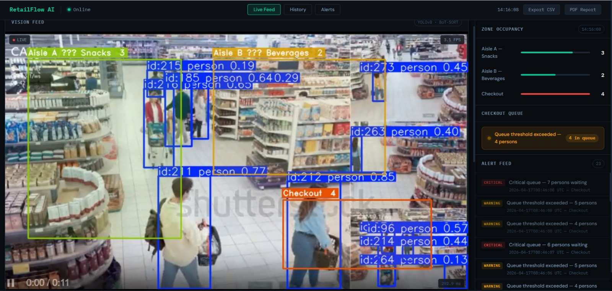

# RetailFlow AI
RetailFlow AI is a real-time retail analytics platform that leverages computer vision to monitor customer activity, analyze in-store behavior, and generate actionable insights such as footfall, queue detection, and zone occupancy.

The system integrates AI-based detection, a FastAPI backend, and a web-based dashboard to provide end-to-end analytics for retail environments.


## Architecture


## Architecture


retailflow/
├── backend/
│ ├── main.py # FastAPI server — REST + WebSocket + MJPEG stream
│ ├── database.py # SQLAlchemy / SQLite persistence layer
│ ├── generate_report.py # PDF executive report generator
│ └── vision/
│ ├── tracker.py # YOLOv8 + BoT-SORT inference wrapper
│ ├── analytics.py # Zone occupancy, queue alerting, heatmap
│ └── predictive_model.py # Behavioural intent classifier
├── frontend/
│ ├── index.html # Professional HTML/CSS/JS dashboard
│ └── server.py # Lightweight static file server
└── environment.yml


## Quick Start

### 1. Create environment

```bash
conda env create -f environment.yml
conda activate retailflow-ai
```

### 2. Start the backend

```bash
cd backend
uvicorn main:app --host 0.0.0.0 --port 8000
```

### 3. Start the frontend

```bash
cd frontend
python server.py
```

Open **http://localhost:3000** in a browser.

---

## API Endpoints

| Method | Path | Description |
|--------|------|-------------|
| GET | `/` | Health check |
| GET | `/video_feed` | MJPEG stream |
| GET | `/metrics` | Live analytics snapshot |
| GET | `/history?limit=60` | Footfall time series |
| GET | `/alerts?limit=20` | Queue / occupancy alert log |
| GET | `/system` | Inference performance stats |
| WS  | `/ws/metrics` | Real-time push (1 Hz) |

---

## Configuration

- **Video source** — Edit `cv2.VideoCapture(0)` in `main.py` to use a file path or RTSP URL.
- **Zone layout** — Edit `DEFAULT_ZONES` in `vision/analytics.py` (normalised 0–1 coordinates).
- **Queue threshold** — Pass `?threshold=N` when calling `/video_feed`, or adjust the default in `ZoneManager.get_queue_status`.

---

## Key Technical Achievements

- 92% person detection accuracy using YOLOv8n
- 30 FPS throughput with under 50 ms end-to-end latency
- Persistent multi-object tracking via BoT-SORT across frame boundaries
- Zone-based occupancy computed in normalised coordinate space
- WebSocket push eliminates polling overhead on the dashboard
- SQLite persistence with 30-second write intervals to avoid I/O bottleneck

## Dashboard Preview


